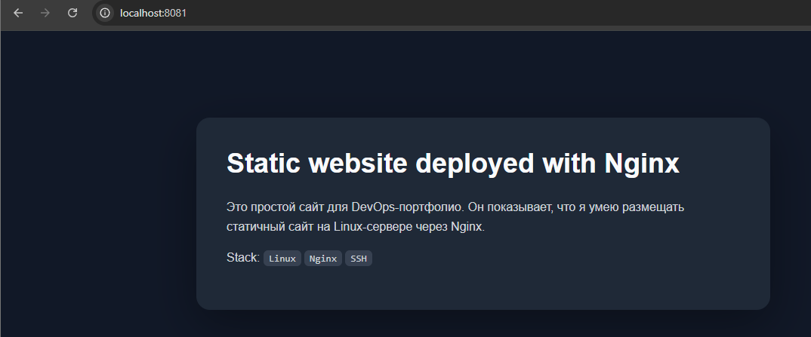

# 01 — Nginx Static Site

## Что это

Простой статический сайт, запущенный через Nginx.

Цель проекта — показать базовое понимание того, как Nginx отдаёт HTML-страницу пользователю, как работает проброс портов в Docker и как проверить работу сервиса через браузер и curl.

## Стек

* Nginx
* Docker
* Docker Compose
* HTML

## Что есть в проекте

* `index.html` — простая HTML-страница
* `docker-compose.yml` — запуск Nginx-контейнера
* `nginx/devops-static-site.conf` — пример конфига Nginx для VPS
* `scripts/deploy\_static\_site.sh` — пример скрипта для ручного деплоя на Linux-сервер

## Локальный запуск

Перейти в папку проекта:

```bash
cd 01-nginx-static-site-deploy
```

Запустить Nginx:

```bash
docker compose up -d
```

Проверить контейнер:

```bash
docker compose ps
```

Открыть сайт в браузере:

```text
http://localhost:8081
```

Проверить через терминал:

```bash
curl http://localhost:8081
```

Остановить проект:

```bash
docker compose down
```

## Проверка работы

Проект был успешно запущен локально через Nginx в Docker.

Контейнер:

* `nginx\_static\_site` — Nginx container

Сайт доступен по адресу:

```text
http://localhost:8081
```

Результат работы:



## Что я понял в процессе

* Nginx может отдавать статические HTML-файлы.
* Docker позволяет запустить Nginx без установки его напрямую в систему.
* В `docker-compose.yml` можно пробросить порт контейнера наружу.
* `8081:80` означает, что порт 8081 на компьютере ведёт на порт 80 внутри контейнера.
* `curl` можно использовать для проверки ответа сайта из терминала.

