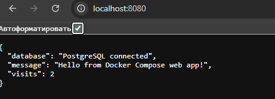

02 — Docker Compose Web App

Цель проекта

Запустить веб-приложение, базу данных PostgreSQL и Nginx через Docker Compose.

Проект показывает навыки:

написание Dockerfile;

сборка Docker image;

запуск нескольких сервисов через Docker Compose;

использование `.env`;

работа с volume для базы данных;

reverse proxy через Nginx;

проверка логов контейнеров.

Стек

Python Flask

PostgreSQL

Docker

Docker Compose

Nginx

Структура

```text

02-docker-compose-web-app/

├── app/

│   ├── app.py

│   ├── Dockerfile

│   └── requirements.txt

├── nginx/

│   └── default.conf

├── docker-compose.yml

├── .env.example

└── README.md

```

Запуск локально

Создать `.env`:

```bash

cp .env.example .env

```

Запустить контейнеры:

```bash

docker compose up -d --build

```

Проверить статус:

```bash

docker compose ps

```

Открыть приложение:

```text

http://localhost:8080

```

Проверить health endpoint:

```bash

curl http://localhost:8080/health

```

Посмотреть логи:

```bash

docker compose logs -f

```

Остановить проект:

```bash

docker compose down

```

Остановить и удалить volume базы:

```bash

docker compose down -v

```

\## Проверка работы


Проект был успешно запущен локально через Docker Compose.


Работают 3 контейнера:


\- devops\_nginx — Nginx reverse proxy

\- devops\_web\_app — Flask web application

\- devops\_postgres — PostgreSQL database


Приложение доступно по адресу:


http://localhost:8080


Health check:


http://localhost:8080/health


Результат работы приложения:




ф

\## Что я понял в процессе


\- Dockerfile описывает, как собрать image для приложения.

\- Docker Compose позволяет запускать несколько связанных сервисов.

\- PostgreSQL хранит данные в Docker volume.

\- Nginx принимает HTTP-запросы и проксирует их в web-контейнер.

\- .env нужен, чтобы не хранить пароли прямо в docker-compose.yml.

