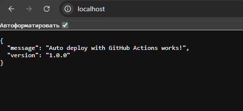

# 03 — GitHub Actions Auto Deploy

## Цель проекта

Настроить автоматический деплой приложения на VPS после `push` в ветку `main`.

Проект показывает навыки:

* работа с GitHub Actions;
* деплой через SSH;
* хранение секретов в GitHub Secrets;
* обновление проекта на сервере через `git pull`;
* перезапуск приложения через Docker Compose;
* базовая подготовка VPS.

## Стек

* GitHub Actions
* SSH
* Docker
* Docker Compose
* Nginx
* Python Flask
* Linux VPS

## Структура

```text
03-github-actions-auto-deploy/
├── .github/
│   └── workflows/
│       └── deploy.yml
├── app/
│   ├── app.py
│   ├── Dockerfile
│   └── requirements.txt
├── nginx/
│   └── default.conf
├── scripts/
│   └── server\_prepare.sh
├── docker-compose.yml
└── README.md
```

## Как работает CI/CD

1. Я делаю изменения в коде.
2. Делаю `git push origin main`.
3. GitHub Actions запускает workflow.
4. Workflow подключается к VPS по SSH.
5. На сервере выполняется:

   * `git pull origin main`
   * `docker compose up -d --build`
   * `docker image prune -f`
6. Приложение обновляется без ручного копирования файлов.

## Secrets для GitHub

В репозитории нужно открыть:

```text
Settings → Secrets and variables → Actions → New repository secret
```

Добавить:

```text
VPS\_HOST=server\_ip
VPS\_USER=server\_user
VPS\_PORT=22
VPS\_SSH\_KEY=private\_ssh\_key
```

Важно: приватный ключ нельзя выкладывать в репозиторий.

## Подготовка сервера

Подключиться к VPS:

```bash
ssh user@SERVER\_IP
```

Скопировать репозиторий:

```bash
git clone https://github.com/YOUR\_USERNAME/github-actions-auto-deploy.git
cd github-actions-auto-deploy
```

Запустить подготовку сервера:

```bash
chmod +x scripts/server\_prepare.sh
./scripts/server\_prepare.sh
```

После установки Docker нужно выйти и зайти по SSH снова:

```bash
exit
ssh user@SERVER\_IP
```

Запустить приложение вручную первый раз:

```bash
docker compose up -d --build
```

Проверить:

```bash
curl http://SERVER\_IP/health
```

## Что я понял в процессе

* GitHub Actions может запускать команды после push.
* Для безопасного подключения к серверу используются GitHub Secrets.
* SSH-ключи нельзя хранить в коде.
* Docker Compose удобно использовать для обновления приложения.
* Nginx может работать как reverse proxy перед приложением.


\## Локальная проверка


Проект был успешно запущен локально через Docker Compose.


Работают 2 контейнера:


\- auto\_deploy\_web — Flask web application

\- auto\_deploy\_nginx — Nginx reverse proxy


Приложение доступно по адресу:


http://localhost


Health check:


http://localhost/health


Результат локального запуска:




